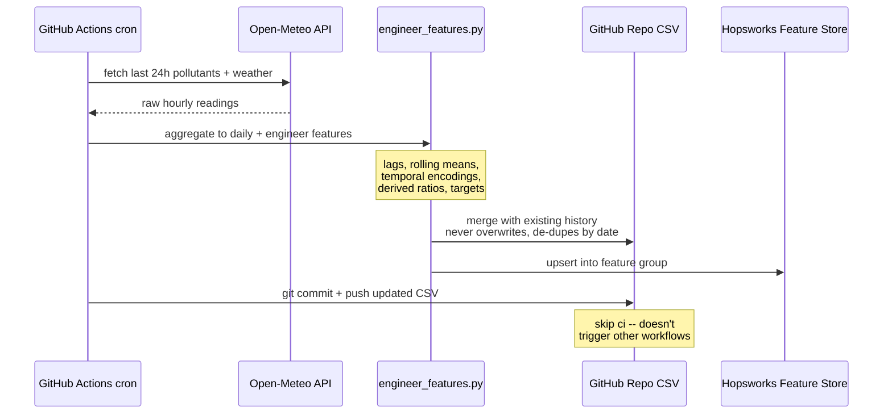
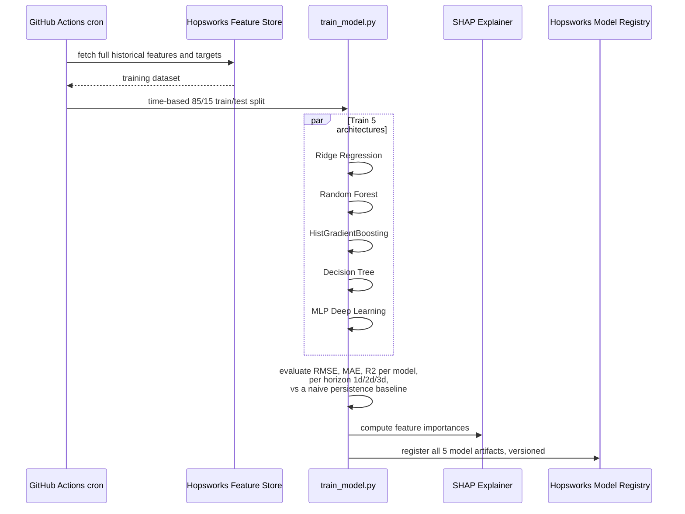
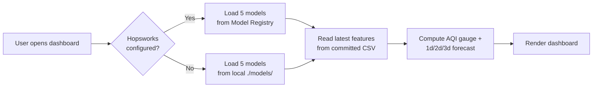

<div align="center">

# Pearls AQI Predictor — Karachi

**A fully serverless, end-to-end machine learning system that forecasts Karachi's Air Quality Index 3 days into the future.**

Built for the **10Pearls Shine Internship Program**

[](https://aqi-predictor-muuoitut5uarhwpuqey8kr.streamlit.app)


*Created by **Muhammad Hassan Siddiqui***

</div>

---

## Table of Contents

- [Overview](#overview)
- [Live Demo](#live-demo)
- [Features](#features)
- [System Architecture](#system-architecture)
- [How the Automation Works](#how-the-automation-works)
  - [Hourly Feature Pipeline](#hourly-feature-pipeline)
  - [Daily Training Pipeline](#daily-training-pipeline)
  - [Serving Layer](#serving-layer)
- [AQI Methodology](#aqi-methodology)
- [Models & Performance](#models--performance)
- [Tech Stack](#tech-stack)
- [Repository Structure](#repository-structure)
- [Getting Started](#getting-started)
  - [1. Quick Local Demo](#1-quick-local-demo-no-accounts-needed)
  - [2. Connect Hopsworks](#2-connect-hopsworks)
  - [3. Automate with GitHub Actions](#3-automate-with-github-actions)
  - [4. Deploy the Dashboard](#4-deploy-the-dashboard-streamlit-community-cloud)
- [Environment Variables](#environment-variables)
- [Troubleshooting](#troubleshooting--lessons-learned)
- [Roadmap](#roadmap)
- [Credits](#credits)
=======
## 🚀 Live Demo
Experience the real-time dashboard here: **[Pearls AQI Predictor](https://aqi-predictor-muuoitut5uarhwpuqey8kr.streamlit.app/)**
>>>>>>> 465d7001632d0b8e6feaf7104e329d8e8db7cf8c

---

## Overview

Air quality in Karachi swings dramatically with the seasons — winter smog regularly pushes AQI into "Unhealthy" territory. This project builds a **production-style forecasting system** that:

1. **Ingests** hourly weather + pollutant data from a free public API (no API key required)
2. **Engineers** a rich feature set (lags, rolling statistics, temporal encodings, derived ratios)
3. **Stores** features in a proper feature store (Hopsworks) — not just a CSV on someone's laptop
4. **Trains** five different regression architectures in parallel and keeps the best
5. **Registers** models in a model registry, versioned and reproducible
6. **Serves** 1-day, 2-day, and 3-day-ahead AQI forecasts through a live public dashboard
7. **Runs unattended** — an hourly cron job keeps data fresh, a daily cron job retrains models, all via GitHub Actions, at zero cost

No servers to maintain. No infrastructure to patch. Everything runs on free tiers of Streamlit Community Cloud, Hopsworks, GitHub Actions, and Open-Meteo.

## Live Demo

**[aqi-predictor-muuoitut5uarhwpuqey8kr.streamlit.app](https://aqi-predictor-muuoitut5uarhwpuqey8kr.streamlit.app)**

## Features

| | |
|---|---|
| 🔴 **Live AQI gauge** | Current Karachi AQI with EPA severity category |
| 🔮 **3-day forecast** | Day+1, Day+2, Day+3 predictions, switchable across 5 model architectures |
| 📊 **Trend charts** | Historical AQI overlaid with the active forecast |
| 🧠 **Explainability** | SHAP feature-importance analysis for every model, at every horizon |
| 📈 **EDA suite** | Seasonal trends, weekday effects, pollutant correlations, rolling statistics |
| ⚠️ **Hazard-aware UI** | Severity-scaled color coding throughout, matching EPA AQI bands |
| 🔁 **Self-updating** | Hourly ingestion + daily retraining, fully automated, zero manual intervention |
| 🧪 **Local dev mode** | Every component runs and is testable without a Hopsworks account, via a local-CSV fallback |

---

## System Architecture

```mermaid
flowchart TB
    subgraph Source["Data Source"]
        OM["Open-Meteo API<br/>pollutants + weather, free, no key"]
    end

    subgraph GHA["GitHub Actions -- runs on schedule, free"]
        FP["Feature Pipeline<br/>hourly cron"]
        TP["Training Pipeline<br/>daily cron at 00:00 UTC"]
    end

    subgraph HW["Hopsworks -- Feature Store and Model Registry"]
        FS[("Feature Group<br/>karachi_aqi_daily")]
        MR[("Model Registry<br/>5 model architectures")]
    end

    subgraph Repo["GitHub Repository"]
        CSV["karachi_daily_features.csv<br/>auto-committed after every run"]
    end

    subgraph App["Streamlit Community Cloud"]
        DASH["Dashboard<br/>frontend/app.py"]
    end

    USER(["User"])

    OM -->|"raw pollutants + weather"| FP
    FP -->|"engineer features"| FS
    FP -->|"commit fresh data"| CSV
    FS -->|"read historical features"| TP
    TP -->|"train 5 models, evaluate"| TP
    TP -->|"register best artifacts"| MR
    MR -->|"download latest models"| DASH
    CSV -->|"read latest features<br/>avoids flaky live reads"| DASH
    DASH -->|"forecast + charts"| USER

    style OM fill:#FDC830,color:#1C2321
    style FS fill:#1EB182,color:#fff
    style MR fill:#1EB182,color:#fff
    style DASH fill:#0E7C86,color:#fff
    style CSV fill:#E0631E,color:#fff
```



**Why a local CSV in the loop, if there's a real feature store?** Hopsworks' *online* feature store requires a direct low-level connection that hangs indefinitely on network-restricted hosts like Streamlit Community Cloud. Rather than fight that restriction, the hourly pipeline commits the freshly engineered data straight back to this repo, and the dashboard reads that file at serve time — fast, reliable, and it doesn't need a live database connection at request time. Hopsworks remains the source of truth for the *feature store and model registry* (versioning, lineage, reproducibility); the CSV is just a fast, always-fresh cache the dashboard actually reads from. See [Troubleshooting](#troubleshooting--lessons-learned) for the full story.

---

## How the Automation Works

### Hourly Feature Pipeline

`.github/workflows/feature-pipeline.yml` → `data_pipeline/pipeline_manager.py`



**Key design decision:** the pipeline always merges newly-fetched data with existing history before writing, rather than overwriting the file. An earlier version of this logic destroyed 3 years of historical data on its first run with `--days 1` — see [Troubleshooting](#troubleshooting--lessons-learned).

### Daily Training Pipeline

`.github/workflows/training-pipeline.yml` → `ml_pipeline/train_model.py`



**Why a time-based split, not a random shuffle?** Shuffling would leak future information into training — a model that's seen tomorrow's AQI while training on today's would look artificially good. The most recent 15% of the timeline is held out, untouched, exactly as it would be in production.

**Why compare against a persistence baseline?** "Tomorrow's AQI will be about the same as today's" is a shockingly strong baseline for autocorrelated environmental data. Every model here is benchmarked against it — a model that can't beat "just guess today's value" isn't adding anything.

### Serving Layer



This dual-path design (Hopsworks registry / local files) means the **exact same codebase** runs in three different contexts without modification: a laptop with no accounts set up, a GitHub Actions runner with full credentials, and the public Streamlit Cloud deployment.

---

## AQI Methodology

Open-Meteo returns raw pollutant concentrations, not a ready-made AQI value. `data_pipeline/engineer_features.py` computes the **official US EPA AQI** from those concentrations using the standard breakpoint formula across all six criteria pollutants (PM2.5, PM10, CO, SO₂, NO₂, O₃) and takes the **maximum sub-index** — the same convention AirNow and other official monitors use.

| AQI Range | Category | Color |
|---|---|---|
| 0–50 | Good | 🟢 |
| 51–100 | Moderate | 🟡 |
| 101–150 | Unhealthy for Sensitive Groups | 🟠 |
| 151–200 | Unhealthy | 🔴 |
| 201–300 | Very Unhealthy | 🟣 |
| 301–500 | Hazardous | 🟤 |

---

## Models & Performance

Five architectures are trained and evaluated on every run, from a linear baseline to a small neural network, so the system isn't betting on a single algorithm being right for this data:

| Model | Type | 1-Day R² | Notes |
|---|---|---|---|
| **Ridge Regression** | Linear | **0.866** | Best performer — AQI's strong day-to-day autocorrelation favors a simple, well-regularized linear fit |
| HistGradientBoosting | Ensemble (boosted trees) | 0.824 | Strong nonlinear performance, fast to train |
| Random Forest | Ensemble (bagged trees) | 0.819 | Robust, gives clean SHAP importances |
| MLP (Deep Learning) | Neural network | 0.750 | 2 hidden layers + dropout, early stopping |
| Decision Tree | Single tree | 0.705 | Weakest, included as an interpretable baseline |

*(Naive persistence baseline: R² ≈ 0.552 — every trained model here beats it comfortably.)*

Full metrics (RMSE, MAE, R² at all three horizons) are recomputed on every daily training run and logged to Hopsworks Model Registry alongside each model version. SHAP feature-importance plots for every model × horizon combination live in `analysis/output/shap/`.

---

## Tech Stack

| Layer | Technology |
|---|---|
| Data source | [Open-Meteo Air Quality & Weather APIs](https://open-meteo.com/) (free, no key) |
| Feature engineering | Python, pandas |
| Feature store | [Hopsworks](https://www.hopsworks.ai/) (free tier) |
| Model training | scikit-learn (Ridge, RF, HGBR, Decision Tree), TensorFlow/Keras (MLP) |
| Explainability | SHAP |
| Model registry | Hopsworks Model Registry |
| Orchestration / automation | GitHub Actions (cron-scheduled workflows) |
| Serving | FastAPI (optional API mode) |
| Dashboard | Streamlit, Plotly |
| Hosting | Streamlit Community Cloud |

---

## Repository Structure

```
aqi-predictor/
├── .github/workflows/
│   ├── feature-pipeline.yml      # hourly: fetch -> engineer -> Hopsworks -> auto-commit CSV
│   └── training-pipeline.yml     # daily: train 5 models -> SHAP -> Hopsworks registry
├── .streamlit/
│   ├── config.toml                # theme (warm white / teal accent)
│   └── secrets.toml.template      # reference for required secrets (no real values)
├── data_pipeline/
│   ├── data_fetcher.py            # Open-Meteo API client
│   ├── engineer_features.py       # daily aggregation, lags, rolling stats, EPA AQI calc
│   ├── hopsworks_connector.py     # Feature Store read/write helpers
│   └── pipeline_manager.py        # orchestrates the hourly pipeline, merges history
├── ml_pipeline/
│   ├── train_model.py             # trains + evaluates all 5 architectures
│   └── model_utils.py             # Model Registry upload/download helpers
├── backend/
│   ├── engine.py                  # core prediction logic (Hopsworks-registry OR local-file mode)
│   └── main.py                    # optional FastAPI serving layer
├── frontend/
│   ├── app.py                     # the Streamlit dashboard
│   └── assets/                    # logo, favicon
├── analysis/
│   ├── run_eda.py                 # exploratory data analysis -> analysis/output/eda/
│   └── run_shap.py                # SHAP explainability -> analysis/output/shap/
├── data/feature_store/
│   └── karachi_daily_features.csv # auto-updated by the hourly pipeline
├── models/                        # locally-trained model artifacts (dev/demo mode)
├── requirements.txt
├── CHANGES.md                     # engineering changelog vs. the original reference build
└── README.md
```

---

## Getting Started

### 1. Quick Local Demo (no accounts needed)

The repo ships with 3+ years of real Karachi data and pre-trained models, so the dashboard runs immediately:

```bash
python -m venv .venv
source .venv/bin/activate        # Windows: .venv\Scripts\activate
pip install -r requirements.txt

export PYTHONPATH=.              # Windows PowerShell: $env:PYTHONPATH="."
streamlit run frontend/app.py
```

Every script auto-detects whether Hopsworks credentials are present and falls back to local files when they aren't — so training, EDA, and SHAP analysis all work offline too:

```bash
python -m ml_pipeline.train_model     # retrains all 5 models locally
python -m analysis.run_eda            # regenerates EDA charts
python -m analysis.run_shap            # regenerates SHAP plots
```

### 2. Connect Hopsworks

1. Sign up free at [app.hopsworks.ai](https://app.hopsworks.ai/)
2. Create a project, note its exact name
3. Account Settings → API → generate a key with full scopes
4. Create `.env` in the project root:
   ```env
   HOPSWORKS_API_KEY=your_key_here
   HOPSWORKS_PROJECT=your_project_name
   ```
5. Backfill real history into your feature store:
   ```bash
   python -m data_pipeline.pipeline_manager --days 365
   ```

### 3. Automate with GitHub Actions

In your GitHub repo → **Settings → Secrets and variables → Actions**, add:

| Secret | Value |
|---|---|
| `HOPSWORKS_API_KEY` | your Hopsworks API key |
| `HOPSWORKS_PROJECT` | your Hopsworks project name |

That's it — `.github/workflows/feature-pipeline.yml` runs hourly and `.github/workflows/training-pipeline.yml` runs daily, both also triggerable manually from the **Actions** tab (`workflow_dispatch`).

### 4. Deploy the Dashboard (Streamlit Community Cloud)

1. [share.streamlit.io](https://share.streamlit.io) → sign in with GitHub → **Create app**
2. Repository: your fork, Branch: `main`, Main file path: `frontend/app.py`
3. Advanced settings → Secrets:
   ```toml
   HOPSWORKS_API_KEY = "your_key_here"
   HOPSWORKS_PROJECT = "your_project_name"
   ```
4. Deploy. Auto-redeploys on every push to `main` — including the bot commits from the hourly pipeline.

---

## Environment Variables

| Variable | Required | Used by | Purpose |
|---|---|---|---|
| `HOPSWORKS_API_KEY` | Optional* | pipeline, training, dashboard | Authenticates to Hopsworks |
| `HOPSWORKS_PROJECT` | Optional* | pipeline, training, dashboard | Which Hopsworks project to use |
| `USE_API_MODE` | Optional | dashboard | Set to `1` to make the dashboard call a separately-running FastAPI backend instead of importing the engine directly |
| `API_BASE_URL` | Optional | dashboard (API mode only) | Where the FastAPI backend is running, defaults to `http://localhost:8000` |

*Not required for local development — everything falls back to local files. Required for GitHub Actions automation to actually persist anything between runs.

---

<<<<<<< HEAD
## Troubleshooting — Lessons Learned

Real issues hit and fixed while building this out, kept here since they'll likely bite anyone extending this project too:

<details>
<summary><b>Local pip install fails with a build error on Windows (Python 3.13)</b></summary>
<br>
Old pinned versions of <code>pandas</code>/<code>numpy</code> predate Python 3.13 wheels, so pip tries to compile from source and needs a C++ toolchain most Windows machines don't have. Fix: relax the pins in <code>requirements.txt</code> to unpinned/lower-bound-only versions.
</details>

<details>
<summary><b><code>hopsworks</code> fails to install: <code>Failed building wheel for twofish</code></b></summary>
<br>
<code>twofish</code> is a C-extension transitive dependency with no Windows wheel. Not actually needed for local dev (every script imports Hopsworks lazily, only when credentials are present) — comment it out locally, it installs fine automatically on GitHub Actions' Linux runners.
</details>

<details>
<summary><b><code>Cannot use time_travel_format='DELTA': delta library is not installed</code></b></summary>
<br>
Newer Hopsworks client versions default new feature groups to Delta Lake format, which needs an extra dependency. Fixed by explicitly passing <code>time_travel_format="HUDI"</code> in <code>hopsworks_connector.py</code> — the traditional format, no extra dependency needed.
</details>

<details>
<summary><b><code>No hudi properties found for featuregroup ... no data has been written yet</code></b></summary>
<br>
The offline (analytical) Hudi table can lag behind or fail to commit even when writes otherwise succeed. Fixed by having the dashboard read from the auto-committed local CSV instead of a live Hopsworks read at serve time (see <a href="#system-architecture">architecture</a> above) — Hopsworks stays the system of record, but isn't a single point of failure for the live UI.
</details>

<details>
<summary><b>Streamlit Cloud hangs indefinitely reading the online feature store</b></summary>
<br>
Hopsworks' online store needs a direct low-level DB connection that Streamlit Cloud's sandboxed network blocks — it retries forever without ever raising a catchable exception. This is the other half of why the dashboard reads from the committed CSV rather than a live online-store read.
</details>

<details>
<summary><b>Sidebar gets permanently stuck collapsed, with no way to reopen it</b></summary>
<br>
Custom CSS hiding Streamlit's default toolbar (<code>header { visibility: hidden; }</code>) also hides the sidebar's own re-expand control, which lives in the same DOM region. Fixed by targeting the Deploy button / hamburger menu by their own specific <code>data-testid</code>s instead of the whole header/toolbar wrapper.
</details>

<details>
<summary><b>Feature pipeline silently destroys historical data on every run</b></summary>
<br>
The original pipeline overwrote the local CSV with <i>only</i> the newly-fetched window. Since the hourly workflow fetches just 1 day at a time, every run reduced 3 years of history to a single day. Fixed by merging new data with existing history (de-duplicated by date) before recomputing derived features across the full series.
</details>

---

## Roadmap

- [ ] Add weather-only features (wind direction, pressure) — wind dispersion strongly affects AQI and isn't fully captured yet
- [ ] LSTM/temporal architecture as a 6th model, better suited to sequential dependence than a flat MLP
- [ ] Per-pollutant sub-forecasts, not just the aggregate AQI
- [ ] Automated hazard alerting (email/SMS when forecast crosses "Unhealthy")
- [ ] Multi-city support beyond Karachi

---

## Credits

**Created by Muhammad Hassan Siddiqui**, for the 10Pearls Shine Internship Program.

- Data: [Open-Meteo](https://open-meteo.com/)
- Feature Store & Model Registry: [Hopsworks](https://www.hopsworks.ai/)
- Hosting: [Streamlit Community Cloud](https://streamlit.io/cloud)
=======
## 📝 License & Credits
Developed as part of the **10Pearls Shine Internship Program**.
Data provided by [Open-Meteo](https://open-meteo.com/).
>>>>>>> 465d7001632d0b8e6feaf7104e329d8e8db7cf8c
